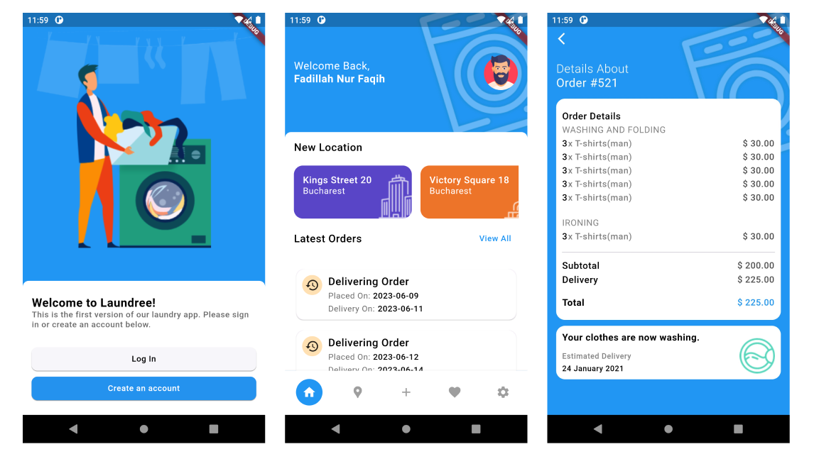

# Slicing Aplikasi Laundry

## Cara menjalankan aplikasi

Pastikan sudah menginstall Git dan Flutter pada environment kalian.

### Prerequisites

- Flutter
  ```sh
  https://docs.flutter.dev/get-started/install
  ```
- Git
  ```sh
  https://git-scm.com/downloads
  ```
  
### Installation

1. Clone the repo
   ```sh
   git clone https://github.com/fadillahnurfaq/slicing_laundry
   ```
2. Install the dependencies
   ```sh
   flutter pub get
   ```
3. Run
   ```sh
   Run Without Debugging On Vs Code
   ```

## Detail Aplikasi




## Dependencies
Berikut ini merupakan dependencies yang digunakan dalam slicing ini:

### Dependency Injection
- get_it: ^7.6.0
